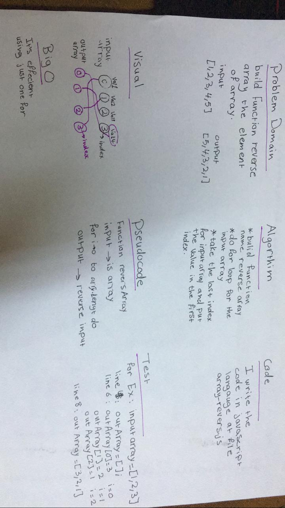

# data-structures-and-algorithms

## Table Of Content
challenges | link
----|-----
arrayReverse | [challenge 1](./challenges/arrayReverse/array-reverse.js)

# Reverse an Array
make a function name reverseArray

## Challenge
in this challange, create function name reverseArray. this function reverse the elment of array ex: input[1,2,3,4,5] output[5,4,3,2,1]

## Approach & Efficiency
I did a method by using for loop and index of array.
## Solution
