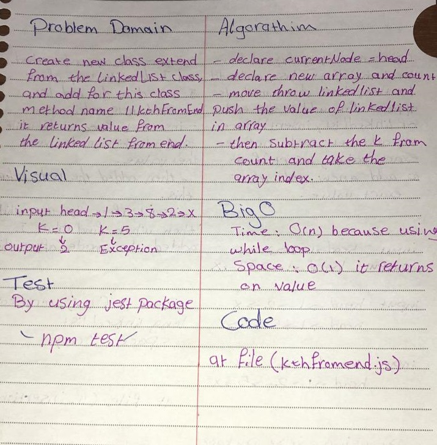

# Linked List KthFromend

## Challenge
create new class extend from the LinkedList class, and add for this class method name llkthFromEnd, it return value from the linkedlist from end. 

## Approach & Efficiency
- I used while loop and array to save value then return spcefic one.
- I did the test by using this command `npm test`

## links
- [pull request](https://github.com/sondos-401-advanced-javascript/data-structures-and-algorithms/pull/10)

- [github actions](https://github.com/sondos-401-advanced-javascript/data-structures-and-algorithms/actions)

## Big O
time for the three method llkthFromEnd O(1) because there is while Loop **Time**: worst case: if the size of linked list big. **Space**: llkthFromEnd O(1) because it return one element.

## Solution
