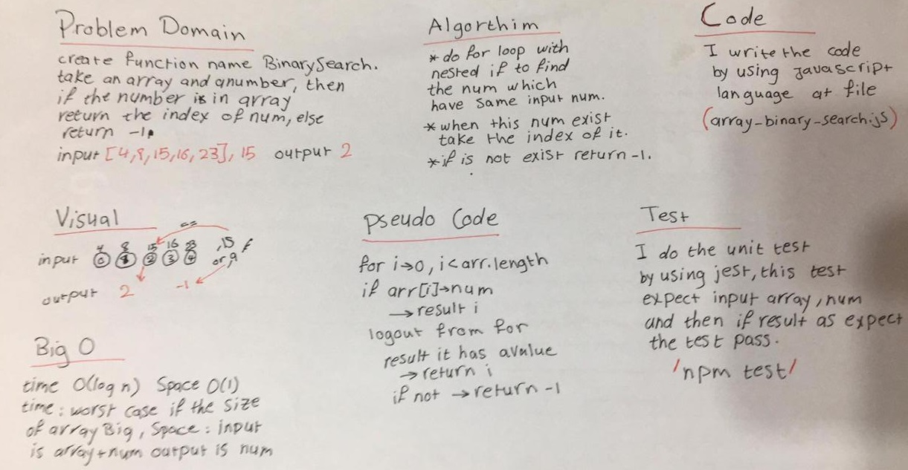

# array Binary Search
make a function name BinarySearch 

## Challenge
in this challange, create function name BinarySearch. this function take array and number, then if the number is in array return the index of the number if not in array return -1 ex: input[4,8,15,16,23,42], 15 output: 2

## Approach & Efficiency
- I did a method by using for loop, and two if statments.
- I did the test by using this command `npm test`

## links
[pull request](https://github.com/sondos-401-advanced-javascript/data-structures-and-algorithms/pull/5)
[github actions](https://github.com/sondos-401-advanced-javascript/data-structures-and-algorithms/actions)

## Big O
time O(log n) *(if the length of array increase the time increas)* space O(1) **Time**: worst case: if the size of array big. **Space**: the input is array and number, but the output is a number. 

## Solution
