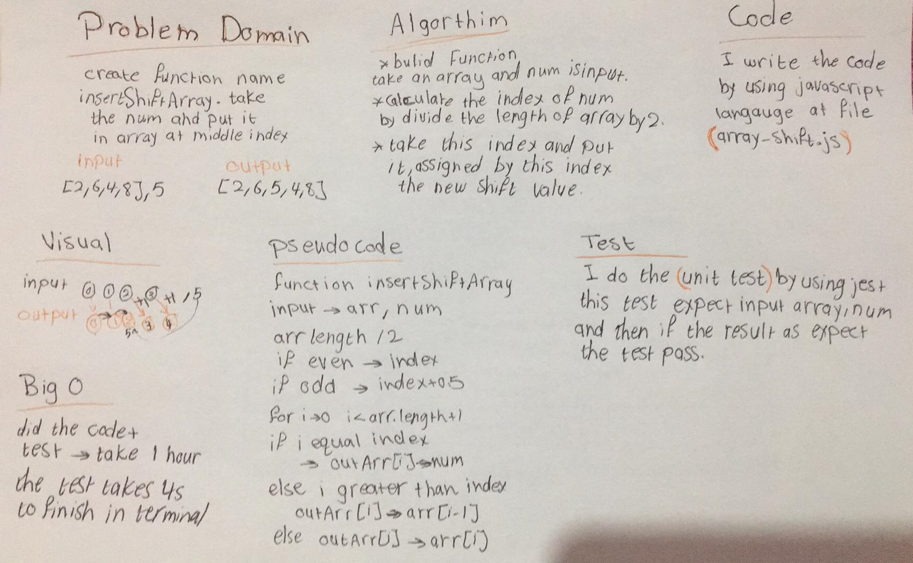

# Shift an Array
make a function name insertShiftArray

## Challenge
in this challange, create function name insertShiftArray. this function take array and number, then add this number at the middle index of array ex: input[4,8,15,23,42],16 output[4,8,15,16,23,42]

## Approach & Efficiency
- I did a method by using for loop, index of array and if statment.
- I did the test by using this command `npm test`

## Big O
Time: for loop have with nested if statement. Space: I used two variables one for index and another for output array, the original array doesn't change. 

## Solution
