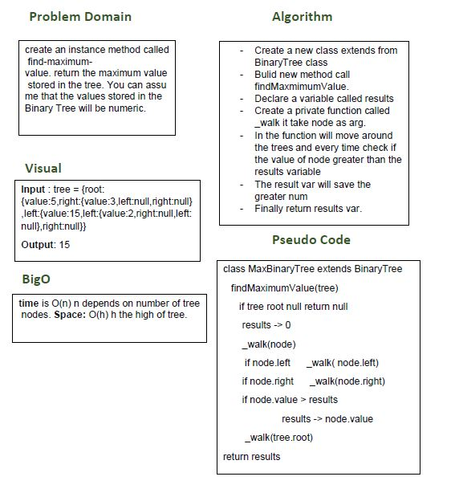

# Find Max Binary Tree

## Challenge
create an instance method called find-maximum-value. return the maximum value stored in the tree. You can assume that the values stored in the Binary Tree will be numeric.

## Approach & Efficiency
- I used while loop and if statment.
- I did the test by using this command `npm test`

## links
- [pull request](https://github.com/sondos-401-advanced-javascript/data-structures-and-algorithms/pull/20)

- [github actions](https://github.com/sondos-401-advanced-javascript/data-structures-and-algorithms/actions)

## Big O
time is O(n) n is num of node **Space**: append O(h) h is high of tree.

## Solution
