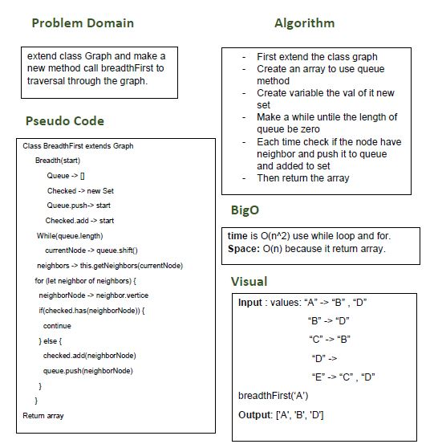

# Breadth First Graph

## Challenge
extend class Graph and make a new method call breadthFirst to trversal through the graph.

## Approach & Efficiency
- I did the test by using this command `npm test`

## links
- [pull request](https://github.com/sondos-401-advanced-javascript/data-structures-and-algorithms/pull/30)

- [github actions](https://github.com/sondos-401-advanced-javascript/data-structures-and-algorithms/actions)

## Big O
time is O(n^2) use while loop and for. **Space**: O(n) becuse it return array.

## Solution
