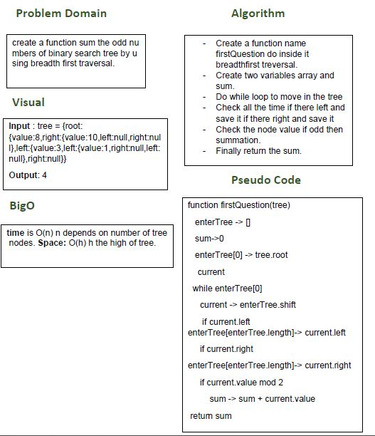

# Sum odd numbers in a binary tree

## Challenge
create a function sum the odd numbers of binary search tree by using breadth first traversal.

## Approach & Efficiency
- I used while loop and if statment.
- I did the test by using this command `npm test`

## links
- [pull request](https://github.com/sondos-401-advanced-javascript/data-structures-and-algorithms/pull/21)

- [github actions](https://github.com/sondos-401-advanced-javascript/data-structures-and-algorithms/actions)

## Big O
time is O(n) n is num of node **Space**: append O(h) h is high of tree.

## Solution
