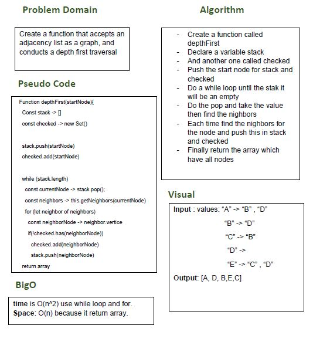

# Depth First Graph

## Challenge
Create a function that accepts an adjacency list as a graph, and conducts a depth first traversal

## Approach & Efficiency
- I did the test by using this command `npm test`

## links
- [pull request](https://github.com/sondos-401-advanced-javascript/data-structures-and-algorithms/pull/32)

- [github actions](https://github.com/sondos-401-advanced-javascript/data-structures-and-algorithms/actions)

## Big O
time is O(n^2) use while loop and for. **Space**: O(n) becuse it return array.

## Solution
