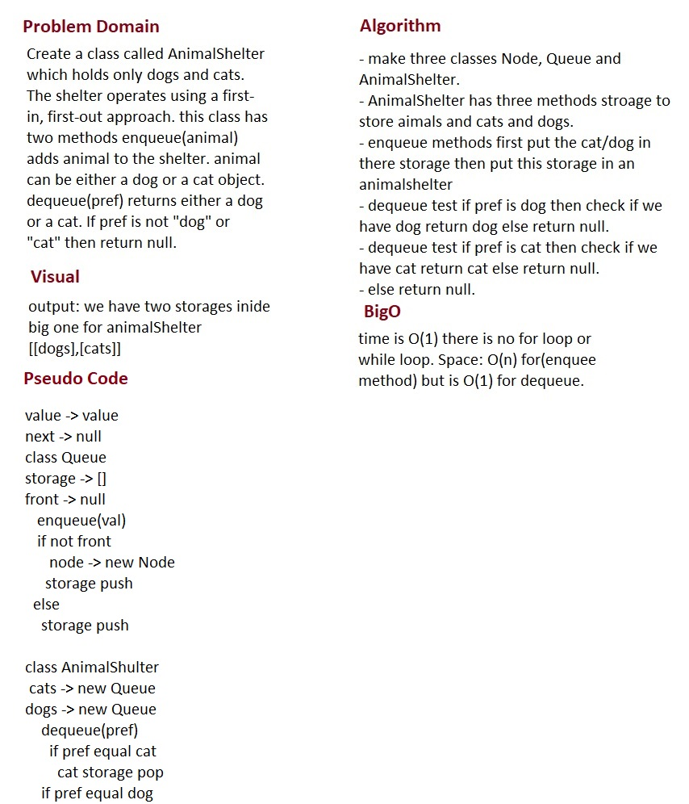

# fifo-animal-shelter

## Challenge
Create a class called AnimalShelter which holds only dogs and cats. The shelter operates using a first-in, first-out approach. this class has two methods enqueue(animal) adds animal to the shelter. animal can be either a dog or a cat object. dequeue(pref) returns either a dog or a cat. If pref is not "dog" or "cat" then return null.

## Approach & Efficiency
- I did the test by using this command `npm test`

## links
- [pull request](https://github.com/sondos-401-advanced-javascript/data-structures-and-algorithms/pull/17)

- [github actions](https://github.com/sondos-401-advanced-javascript/data-structures-and-algorithms/actions)

## Big O
time is O(1) there is no for loop or while loop. **Space**: O(n) for(enquee method) but is O(1) for dequeue.

## Solution
