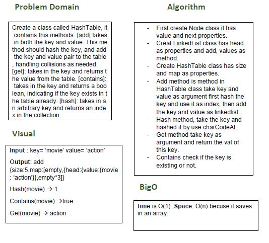

# Hash Table

## Challenge
Create a class called HashTable, it contains this methods: [add] takes in both the key and value. This method should hash the key, and add the key and value pair to the table, handling collisions as needed.
[get]: takes in the key and returns the value from the table. [contains]: takes in the key and returns a boolean, indicating if the key exists in the table already. [hash]: takes in an arbitrary key and returns an index in the collection.

## Approach & Efficiency
- I did the test by using this command `npm test`

## links
- [pull request](https://github.com/sondos-401-advanced-javascript/data-structures-and-algorithms/pull/25)

- [github actions](https://github.com/sondos-401-advanced-javascript/data-structures-and-algorithms/actions)

## Big O
time is O(1). **Space**: O(n) becuse it save in an array.

## Solution
