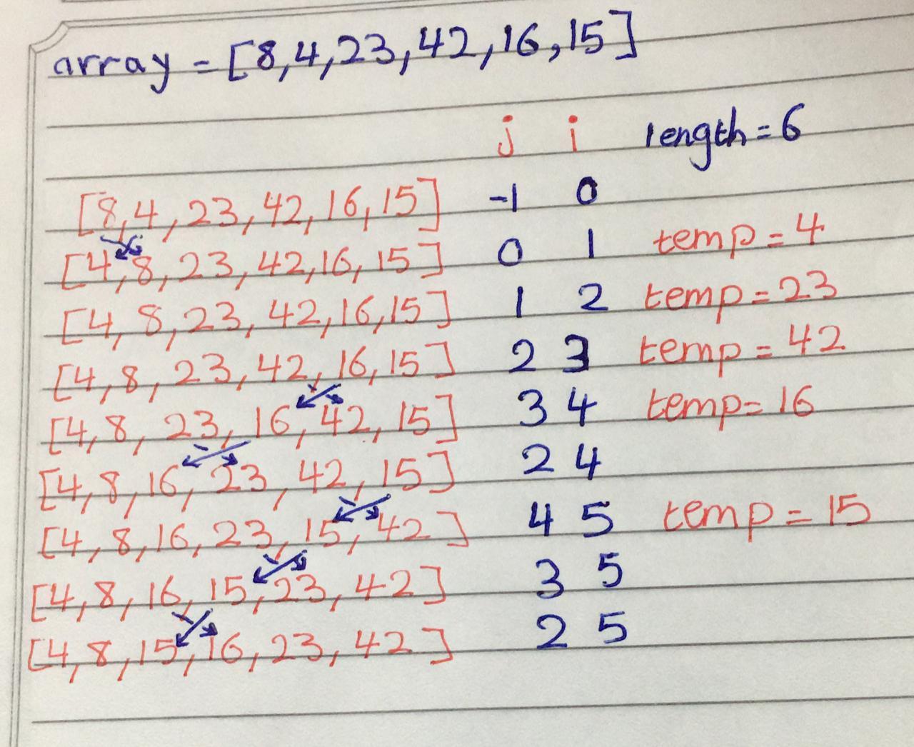

# Challenge Summary

## Challenge Description
convert pseudo code for the insertionSort function to real code. the insertion sort is a method to trversal in an array and sort it from min val to max val.

## Approach & Efficiency
time O(n^2) because we have while loop in for loop, space O(1) because the input same of output in memory.

## Solution

