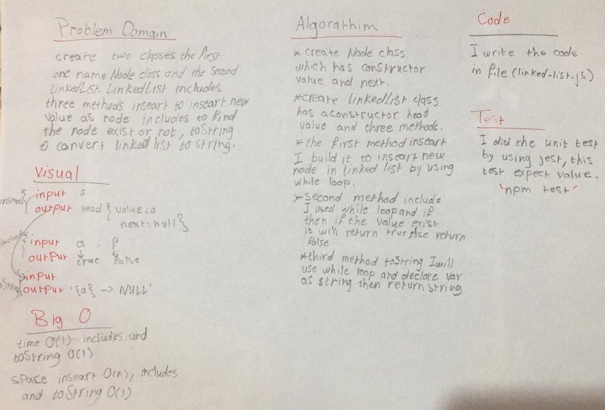

# Linked List

## Challenge
create two classes the first one name Node class and the second LinkedList. LinkedList includes three methods inseart to inseart new value as a node, includes to find if the node exist or not, toString to convert the linked list to string.

## Approach & Efficiency
- I used while loop and if statment.
- I did the test by using this command `npm test`

## links
- [pull request](https://github.com/sondos-401-advanced-javascript/data-structures-and-algorithms/pull/7)

- [github actions](https://github.com/sondos-401-advanced-javascript/data-structures-and-algorithms/actions)

## Big O
time for the insert is O(1) for includes O(n) and toString O(n)**Time**: worst case: if the size of linked list big. **Space**: inseart and toString O(n) for includes  O(1).

## Solution
