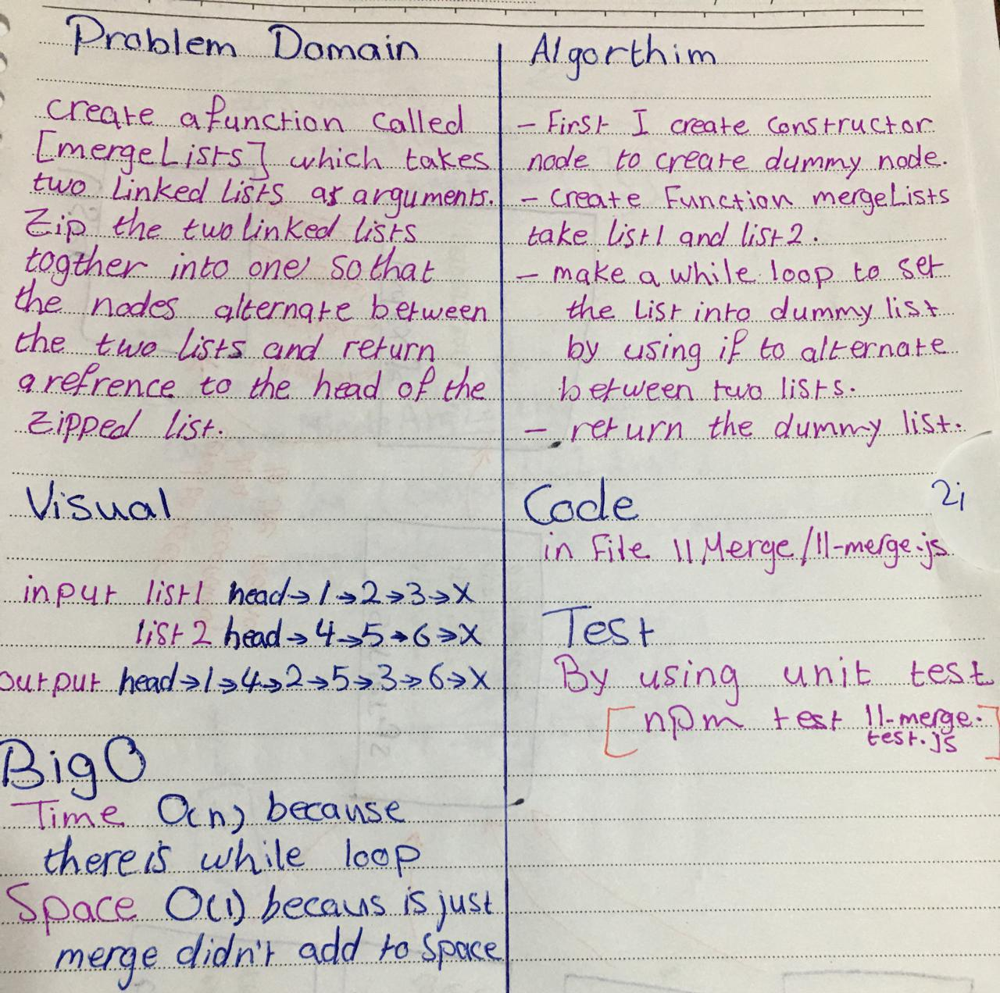

# Merge Linked Lists

## Challenge
create a function called `mergeLists` which takes two linked lists as arguments. Zip the two linked lists together into one so that the nodes alternate between the two lists and return a reference to the head of the zipped list

## Approach & Efficiency
- I maked empty linked list then I used while loop to merge two linked lists and put the result in new linked list.
- I did the test by using this command `npm test`

## links
- [pull request](https://github.com/sondos-401-advanced-javascript/data-structures-and-algorithms/pull/11)

- [github actions](https://github.com/sondos-401-advanced-javascript/data-structures-and-algorithms/actions)

## Big O
time is O(n) because I used while loop**Time**: worst case: if the size of each linked list big. **Space**: O(1) because is just merge didn't add any thing.

## Solution
