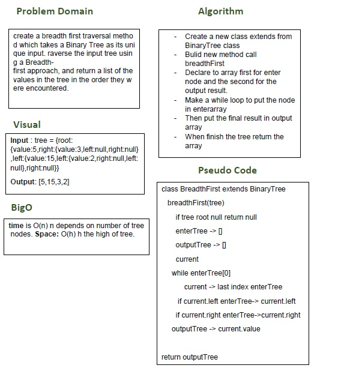

# Breadth First

## Challenge
create a breadth first traversal method which takes a Binary Tree as its unique input. raverse the input tree using a Breadth-first approach, and return a list of the values in the tree in the order they were encountered.

## Approach & Efficiency
- I used while loop and if statment.
- I did the test by using this command `npm test`

## links
- [pull request](https://github.com/sondos-401-advanced-javascript/data-structures-and-algorithms/pull/19)

- [github actions](https://github.com/sondos-401-advanced-javascript/data-structures-and-algorithms/actions)

## Big O
time is O(n) n is num of node **Space**: append O(h) h is high of tree.

## Solution
