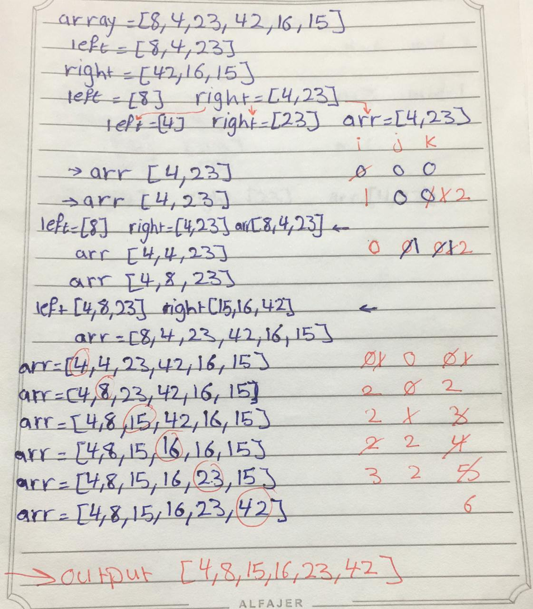

# Challenge Summary

## Challenge Description
convert pseudo code for the mergeSort function to real code. the merge sort is a method to trversal in an array and divide it to two arrays left and right then merge it.

## Approach & Efficiency
time O(n^2) because we have while loop and for loop, space O(1) because the input same of output in memory.

## Solution

