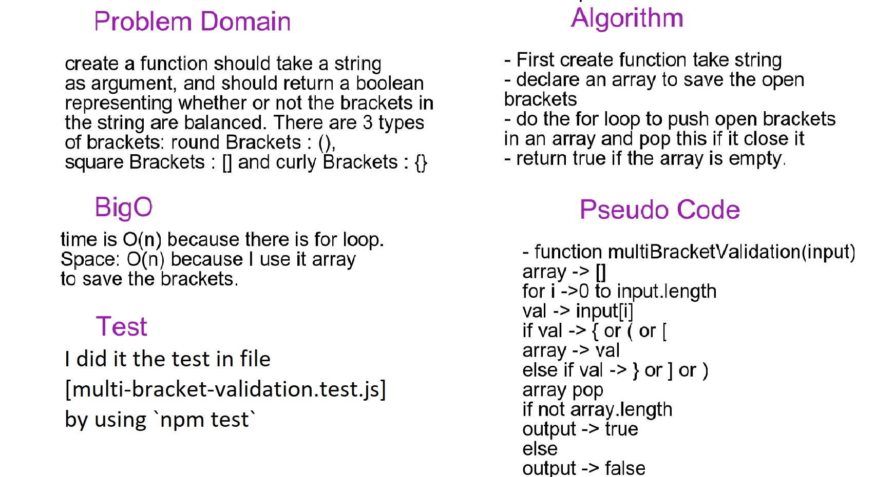

# Multi Bracket Validation

## Challenge
create a function should take a string as argument, and should return a boolean representing whether or not the brackets in the string are balanced. There are 3 types of brackets: round Brackets : (), square Brackets : [] and curly Brackets : {}

## Approach & Efficiency
- I did the test by using this command `npm test`

## links
- [pull request](https://github.com/sondos-401-advanced-javascript/data-structures-and-algorithms/pull/15)

- [github actions](https://github.com/sondos-401-advanced-javascript/data-structures-and-algorithms/actions)

## Big O
time is O(n) because there is for loop. **Space**: O(n) because I use it array to save the brackets.

## Solution
