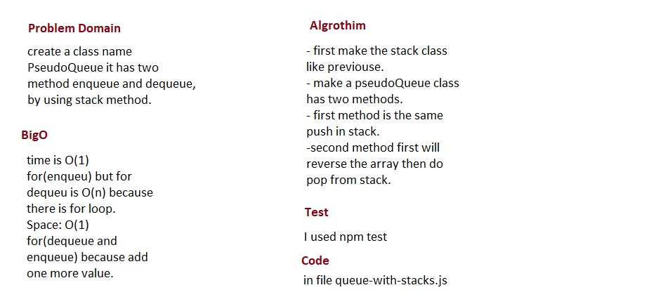

# Queue with stacks

## Challenge
create a class name PseudoQueue it has two method enqueue and dequeue, by using stack method.

## Approach & Efficiency
- I did the test by using this command `npm test`

## links
- [pull request](https://github.com/sondos-401-advanced-javascript/data-structures-and-algorithms/pull/14)

- [github actions](https://github.com/sondos-401-advanced-javascript/data-structures-and-algorithms/actions)

## Big O
time is O(1) for(enqueu) but for dequeu is O(n) because there is for loop. **Space**: O(1) for(dequeue and enqueue) because add one more value.

## Solution
