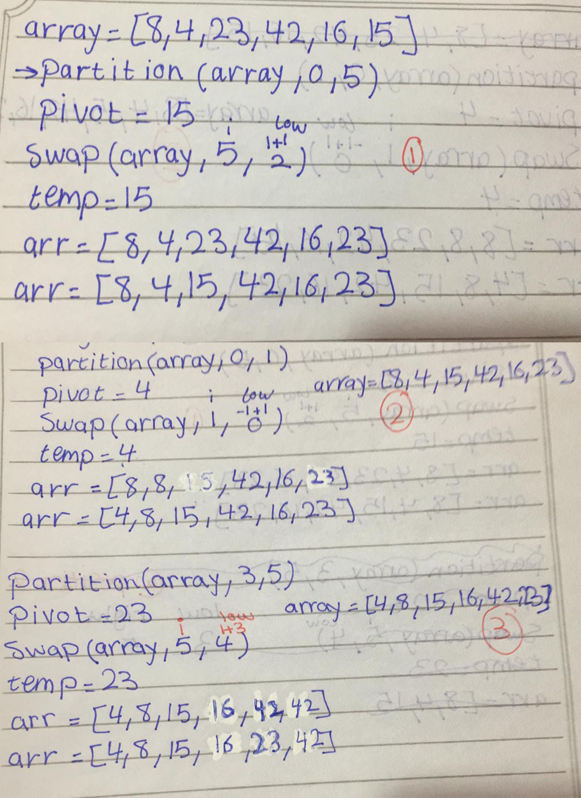

# Challenge Summary

## Challenge Description
convert pseudo code for the quickSort function to real code. 

## Approach & Efficiency
time O(n log n) because when the array be long it take more time, space O(1) because the input same of output in memory.

## Solution

