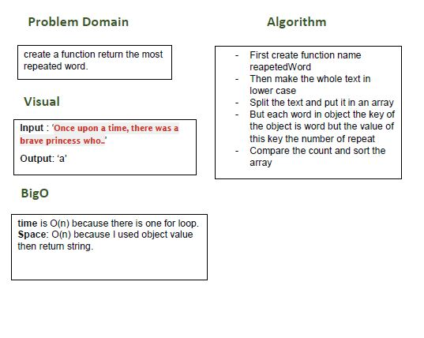

# repeated word

## Challenge
create a function return the most frequnet word reapeted.

## Approach & Efficiency
- I did the test by using this command `npm test`

## links
- [pull request](https://github.com/sondos-401-advanced-javascript/data-structures-and-algorithms/pull/26)

- [github actions](https://github.com/sondos-401-advanced-javascript/data-structures-and-algorithms/actions)

## Big O
time is O(n) because there is one for loop. **Space**: O(n) I use object to save the value.

## Solution
