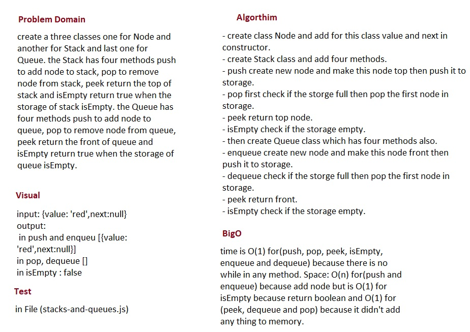

# Stack and Queue

## Challenge
create a three classes one for Node and another for Stack and last one for Queue. the Stack has four methods push to add node to stack, pop to remove node from stack, peek return the top of stack and isEmpty return true when the storage of stack isEmpty. the Queue has four methods push to add node to queue, pop to remove node from queue, peek return the front of queue and isEmpty return true when the storage of queue isEmpty.

## Approach & Efficiency
- I did the test by using this command `npm test`

## links
- [pull request](https://github.com/sondos-401-advanced-javascript/data-structures-and-algorithms/pull/12)

- [github actions](https://github.com/sondos-401-advanced-javascript/data-structures-and-algorithms/actions)

## Big O
time is O(1) for(push, pop, peek, isEmpty, enqueue and dequeue) because there is no while in any method. **Space**: O(n) for(push and enqueue) because add node but is O(1) for isEmpty because return boolean and O(1) for (peek, dequeue and pop) because it didn't add any thing to memory.

## Solution
