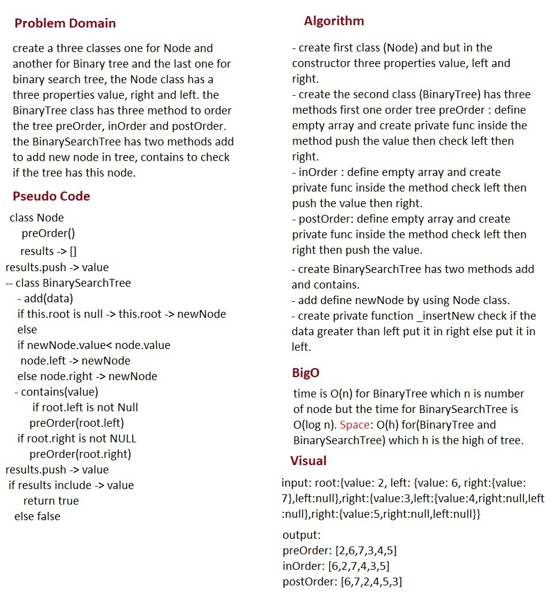

# Tree

## Challenge
create a three classes one for Node and another for Binary tree and the last one for binary search tree, the Node class has a three properties value, right and left. the BinaryTree class has three method to order the tree preOrder, inOrder and postOrder. the BinarySearchTree has two methods add to add new node in tree, contains to check if the tree has this node.

## Approach & Efficiency
- I did the test by using this command `npm test`

## links
- [pull request](https://github.com/sondos-401-advanced-javascript/data-structures-and-algorithms/pull/16)

- [github actions](https://github.com/sondos-401-advanced-javascript/data-structures-and-algorithms/actions)

## Big O
time is O(n) for BinaryTree which n is number of node but the time for BinarySearchTree is O(log n). **Space**: O(h) for(BinaryTree and BinarySearchTree) which h is the high of tree.

## Solution
