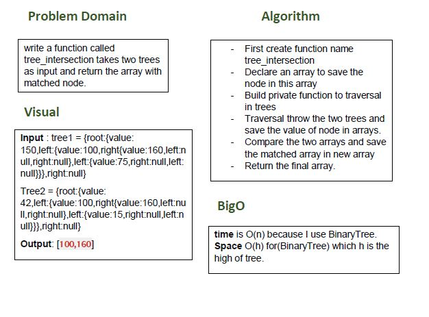

# Tree

## Challenge
write a function called tree_intersection takes two trees as input and return the array with matched node.

## Approach & Efficiency
- I did the test by using this command `npm test`

## links
- [pull request](https://github.com/sondos-401-advanced-javascript/data-structures-and-algorithms/pull/16)

- [github actions](https://github.com/sondos-401-advanced-javascript/data-structures-and-algorithms/actions)

## Big O
time is O(n) because I use BinaryTree. **Space**: O(h) for(BinaryTree) which h is the high of tree.

## Solution
